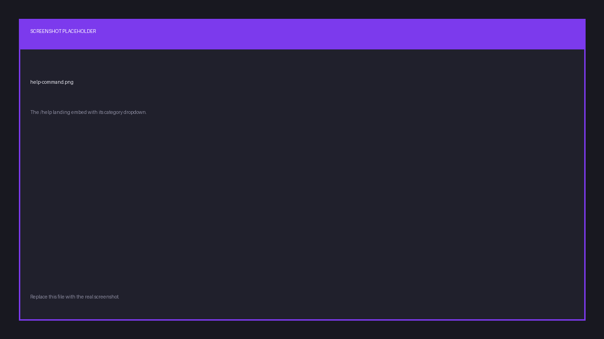
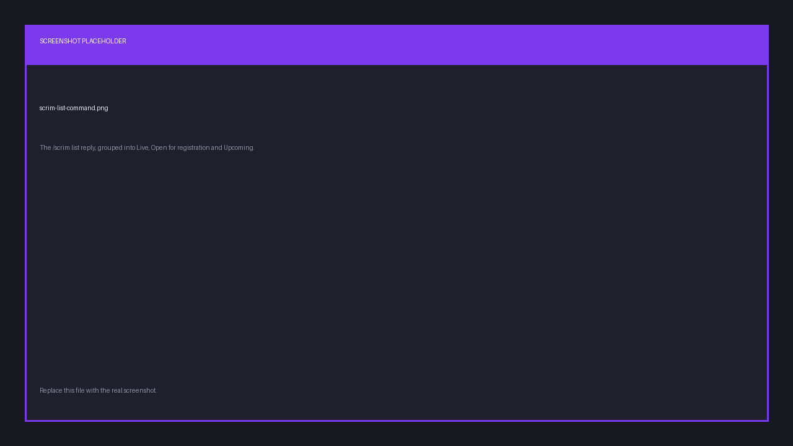

# Command reference

Most of the bot answers with **no Finalist account and no organization**: browsing scrims
and tournaments, reading standings, looking at a roster. An account is asked for at the
point you *enter* something, and an organization only for the organizer surface.

| You want to | You need |
|-------------|----------|
| Browse, look at an event, read standings | Nothing |
| Enter an event, check in, see your own stats | `/link` |
| This server's own scrims, leaderboard and org info | The server [connected to an organization](./connect-server) |
| `/host` | To be an owner or admin of that organization |

## Always available

| Command | Options | What it does |
|---------|---------|--------------|
| `/link` | None | Links your Discord to your Finalist account — one tap, no form. |
| `/help` | `command` (optional) | Browse what the bot can do. Pass a command name for detail. |

`/help` lists every command group with a one-line summary. The dropdown below it opens a
category, and `/help command:<name>` jumps straight to one. Four link buttons sit underneath:
**Support Server**, **Invite Me**, **Documentation** and **Tutorials** — *Invite Me* is the
quickest way to add the bot to another server.

In a server with no organization connected, `/event list` shows every public event on the
platform rather than refusing — so the bot is useful the moment it joins. See
[Connect your server](./connect-server).

## `/event`: browse, enter, and follow

One group for both shapes. A scrim and a tournament are the same kind of thing to the
bot — one event, one entry, one slot — so there is no `/scrim` and no `/tournament` to
choose between. Where a command only makes sense for one shape, its autocomplete only
offers that shape.

The `event` option takes the event's **share id** (the 12-character code from its URL),
and autocompletes, so you rarely type it.

| Command | Options | What it does |
|---------|---------|--------------|
| `/event list` | `type` (optional: scrims or tournaments) | Active events, grouped into Live, Open for registration, and Upcoming. |
| `/event registered` | `type` (optional) | The events you are in, soonest first. |
| `/event view` | `event` (required) | Status, start time, registration window and the slot list. |
| `/event register` | `event` (required) | Enters your team. Only the captain can. |
| `/event unregister` | `event` (required) | Withdraws your entry, after a confirmation that says what it costs. |
| `/event waitlist` | `event` (required) | The queue behind a full event, in order. |
| `/event results` | `event` (required) | Results, or the current standings with the qualification cut marked. |
| `/event matches` | `event` (required) | Your fixtures in a tournament, with the match ids `/event room` takes. |
| `/event checkin` | `event` (required) | Checks your team in for its next match. Miss the window and the slot is forfeited to the waitlist. |
| `/event room` | `match` (required) | Your lobby's room ID and password. Always private. |
| `/event lineup` | `event` (required) | Your lineup and in-game names for a scrim. |

There is no `team` option. The bot resolves which of your teams is entered from the event's
own entry list, rather than asking you to name a team it can already work out — and for a
withdrawal, from the entry that actually exists.

Check-in happens **here**, not on the web: `/event checkin` performs it. It works for a
scrim and a tournament alike, on any event whose organizer asked for check-in.

## `/team`: your teams

| Command | Options | What it does |
|---------|---------|--------------|
| `/team mine` | None | Your teams and their rosters. |
| `/team view` | `code` (required) | A team's roster, by its team code. The captain is marked with a crown. |
| `/team create` | None | Sends you to the web app. The bot doesn't create teams itself. |

## `/me`: your stats and profile

| Command | Options | What it does |
|---------|---------|--------------|
| `/me stats` | `team_id` (optional) | Your recent results, or a team's record. |
| `/me rank` | None | Your standing in this server's organization. |
| `/me profile` | None | Opens your Finalist profile. |

## `/org`: this server's organization

| Command | Options | What it does |
|---------|---------|--------------|
| `/org info` | None | Name, handle and owner of the connected organization. |
| `/org leaderboard` | `board` (optional: `Players` or `Teams`) | Top 10. Defaults to players. |

## `/host`: organizer tools

Restricted to the organization's **owner** and **admins**. This is a platform role, not a
Discord permission. An org admin without Manage Server can still use these, and a Discord
administrator who isn't in the org cannot.

| Command | Options | What it does |
|---------|---------|--------------|
| `/host create` | None | Opens the new-scrim page. |
| `/host edit` | `scrim` (required) | Opens a scrim's management page. |
| `/host registrations` | `scrim` (required) | Lists the teams registered for a scrim. |
| `/host org` | None | Opens organization settings: members, invites, bans, Discord. |
| `/host presets` | None | Opens recurring scrim schedules. |
| `/host bind` | `scrim` (optional) | Posts announcements in this channel. |
| `/host unbind` | None | Stops announcements in this channel. |

Creating and editing happen on the web; `/host` mostly gives you a fast way in, plus the
channel bindings that drive announcements.

## Replies are private

Everything that shows *your* data (`/link`, `/me *`, `/team mine`, `/team create`,
`/host *`, `/event registered`, `/event unregister`, `/event checkin`, `/event matches`
and `/event lineup`) replies ephemerally, so only you see it. `/event list`, `/event view`
and `/team view` post publicly, since they are meant to be shared.

`/event room` is **always** private, whatever the channel. A room ID in a public channel
is a room everyone can join.
