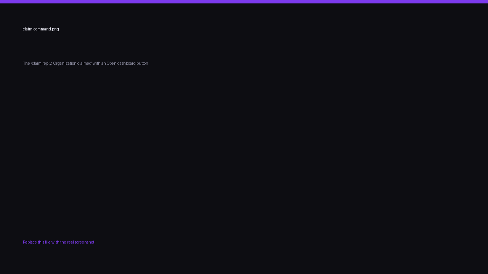

import { links } from '@site/constants';

# Connect your server

The Finalist bot is a companion to the web platform, not a replacement for it.
Scrims are created and managed on <a href={links.manage}>app.finalist.live</a>; the bot
brings announcements, room details and quick lookups into your Discord server.

Every server that uses Finalist is backed by an **organization**, because scrims belong to
an org and never to a person. How you get one depends on whether you already have one.

## If you don't have an organization yet

Just invite the bot.

Finalist notices the bot joining and provisions an organization for that server on the
spot, named after it. You don't fill in a form, and you don't have to visit the dashboard
first.

That organization arrives **unclaimed**: it exists and it's linked to your server, but it
has no owner and no members yet. Claiming it is the next step, and until someone does,
nobody can host with it.


### Claim it

Whoever added the bot is recorded as the **pending owner**. Finalist works that out from
the server's audit log, which is the reason the invite asks for **View Audit Log**. If it
can't read the log, it falls back to the server's owner.

There are two ways to claim, and the first valid one wins:

**In Discord**, run `/claim`. Any member with **Manage Server** can, not just the inviter.
Ownership goes to the Finalist account linked to their Discord. If their Discord isn't
linked yet, the bot says so and they can [link](./link-account) and run it again.



**On the web**, sign in with the Discord account that added the bot. The server shows up as
claimable and you take it in one click.

Whoever claims it becomes the **owner**, and from there it's an ordinary organization: invite
members, give them roles, and [hand ownership on](../organizers/organizations#transferring-ownership)
later if you want.

## If you already have an organization

Connect the server from the dashboard instead.

1. Open your organization on <a href={links.manage}>app.finalist.live</a>.
2. Go to **Settings → Discord**.
3. Select the server you invited the bot to, and connect it.

A server belongs to exactly one organization. Trying to connect one that another org already
owns is rejected.

## What the bot can do before it's connected

Until a server is linked to an organization, the bot only exposes `/link`, `/help` and
`/claim`. Everything else (`/scrim`, `/team`, `/me`, `/org`, `/host`) appears the moment
the link exists, and disappears again if you disconnect.

Because inviting the bot links the server straight away, those commands usually show up
immediately. `/host` is the exception: it needs an org **owner** or **admin**, and an
unclaimed org has neither. Claim first, then host.

## Choose where announcements are posted

By default the bot has nowhere to post. An organization **owner** or **admin** binds a
channel with `/host bind`:

```
/host bind
```


Run it in the channel that should receive announcements. To scope a channel to a
single scrim instead of every scrim in the organization, pass its share id:

```
/host bind scrim:x7Kq2mNp9wLd
```

To stop announcements in a channel:

```
/host unbind
```

## What gets posted

Once a channel is bound, Finalist posts an embed whenever a scrim changes state.

| Status | Message |
|--------|---------|
| `registration_open` | Registration is OPEN |
| `registration_closed` | Registration closed |
| `ongoing` | Scrim is LIVE |
| `completed` | Scrim completed |
| `cancelled` | Scrim cancelled |


Each embed links back to the scrim's page. Room details are posted separately. See
[Room details](./room-details).

Delivery is best-effort: if Discord is unreachable, or a member has DMs closed, the
scrim itself is unaffected.
