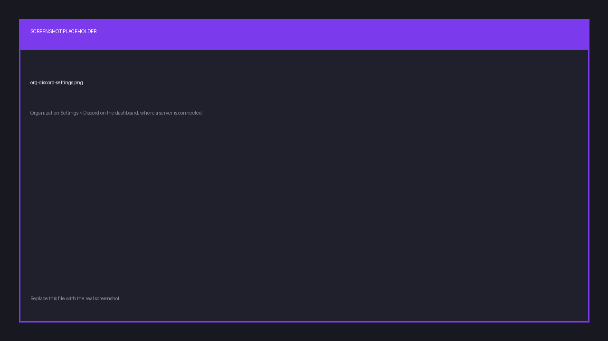
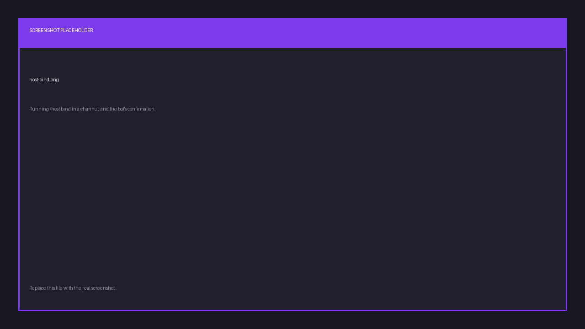
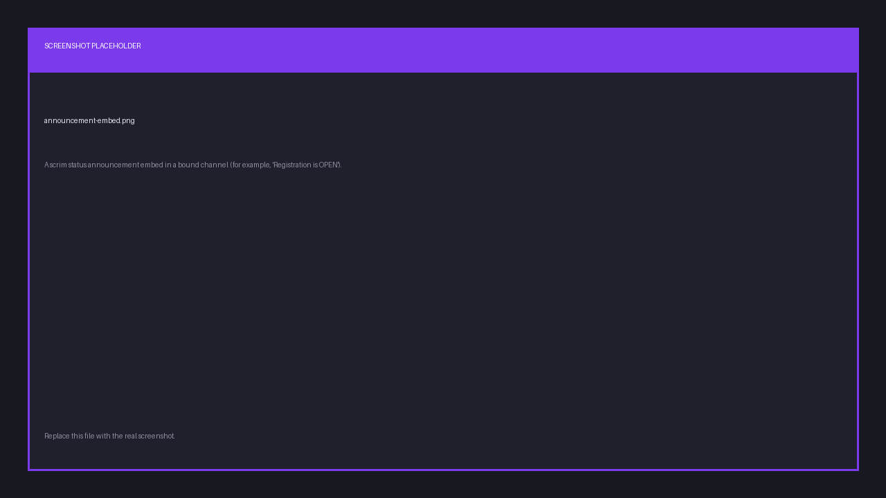

import { links } from '@site/constants';

# Connect your server

The Finalist bot is a companion to the web platform, not a replacement for it.
Scrims are created and managed on <a href={links.manage}>app.finalist.live</a>; the bot
brings announcements, room details and quick lookups into your Discord server.

Until a server is connected to an organization, the bot only exposes `/link` and
`/help`. Everything else (`/scrim`, `/team`, `/me`, `/org`, `/host`) appears the
moment the connection is made, and disappears again if you disconnect.

## Invite the bot

Invite Finalist to your server by clicking <a href={links.botInvite}>here</a>. You need the
"Manage Server" permission in the server you are adding it to.

## Connect the server to an organization

Connecting is done from the dashboard, not from Discord. There is no `/setup` command.

1. Open your organization on <a href={links.manage}>app.finalist.live</a>.
2. Go to **Settings → Discord**.
3. Select the server you just invited the bot to, and connect it.



The gated command groups appear in your server straight away. If someone tries to
use one before the server is connected, the bot replies:

> 🔒 This server isn't connected to an organization yet. An admin can connect it from the organization's Discord settings.

Disconnecting from the same screen removes those commands again.

## Choose where announcements are posted

By default the bot has nowhere to post. An organization **owner** or **admin** binds a
channel with `/host bind`:

```
/host bind
```



Run it in the channel that should receive announcements. To scope a channel to a
single scrim instead of every scrim in the organization, pass its share id:

```
/host bind scrim:x7Kq2mNp9wLd
```

To stop announcements in a channel:

```
/host unbind
```

## What gets posted

Once a channel is bound, Finalist posts an embed whenever a scrim changes state.

| Status | Message |
|--------|---------|
| `registration_open` | Registration is OPEN |
| `registration_closed` | Registration closed |
| `ongoing` | Scrim is LIVE |
| `completed` | Scrim completed |
| `cancelled` | Scrim cancelled |



Each embed links back to the scrim's page. Room details are posted separately. See
[Room details](./room-details).

Delivery is best-effort: if Discord is unreachable, or a member has DMs closed, the
scrim itself is unaffected.
