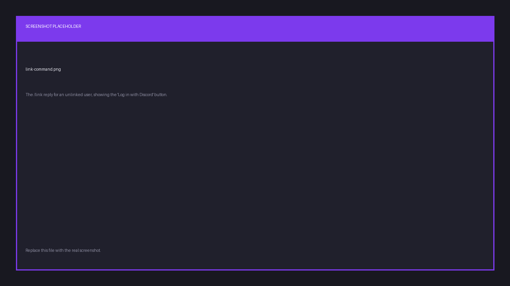

import { links } from '@site/constants';

# Link your account

The bot needs to know which Finalist account belongs to your Discord user before it
can register your team, show your stats, or reveal room details to you.

## If you signed in with Discord

Nothing to do. Logging into <a href={links.play}>play.finalist.live</a> with the **Discord**
option links the two accounts automatically.

## Otherwise

Run `/link` in any server where the bot is present:

```
/link
```

- Already linked: the bot confirms it, and tells you notifications will arrive here.
- Not linked yet: the bot replies with a **Log in with Discord** button. Follow it,
  sign in with Discord, and your accounts are linked from then on.



Both replies are ephemeral, so nobody else in the channel sees them.

`/link` works everywhere, even in a server that isn't connected to an organization.

## When you'll be asked to link

Commands that read your own data nudge you if you haven't linked yet:

> Your Discord isn't linked to a Finalist account yet. Use `/link`.

The same applies to the **Reveal room details** button. Clicking it without a linked
account tells you to run `/link` first.
