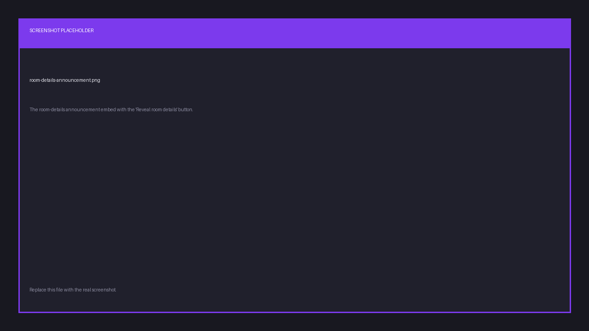
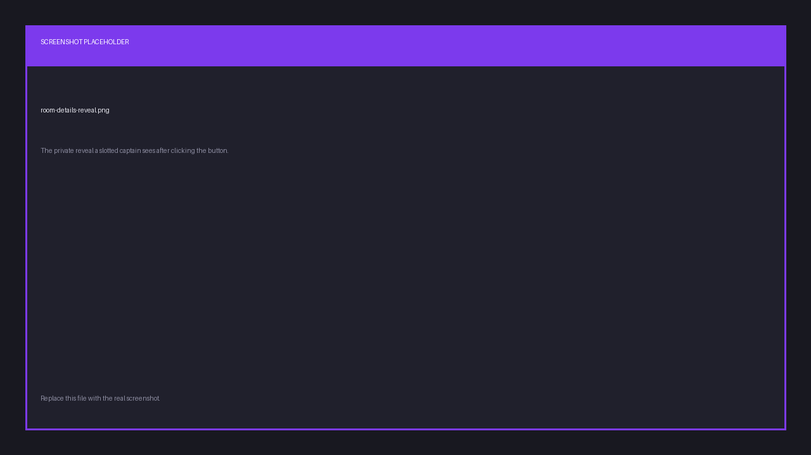

# Room details in Discord

When a host publishes a scrim's lobby credentials, Finalist posts an announcement in the
server's [bound channel](./connect-server):

> 🎟️ Room details are live — *scrim name*

The announcement carries a **Reveal room details** button. It is safe in a public channel:
clicking it never shows the credentials to the channel, only privately to the person who
clicked, and only if they qualify.

## Who can reveal

Only the **captain of a team holding a slot** in that scrim. Everyone else gets:

> 🔒 Only captains of a team in the slotlist can view the room details.

The check happens server-side on every click. Nothing is decided by the button itself.

## What you might see instead

| Situation | Reply |
|-----------|-------|
| Discord not linked | Link your Discord to Finalist first with `/link`, then try again. |
| Host scheduled the reveal for later | Room details aren't revealed yet — check back closer to start time. |
| Not a slotted captain | 🔒 Only captains of a team in the slotlist can view the room details. |

## The reveal

Captains get an ephemeral message titled **🔓 Room details** with each field as a separate
copyable value, so they work on mobile, and a reminder:

> Keep these to your team — don't share the lobby.

The button keeps working after the bot restarts, so an announcement posted hours earlier is
still live.
