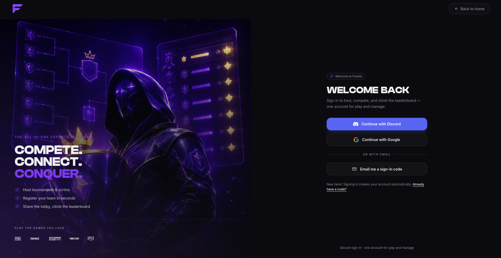
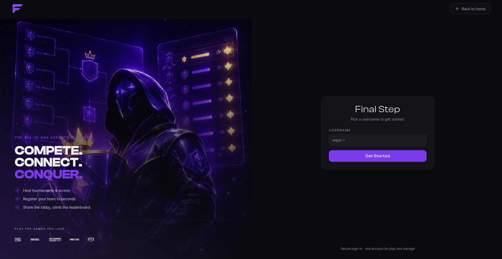

import { links } from '@site/constants';

# Getting Started

Finalist runs scrims: you host them, teams register, slots get assigned, room details go
out, results get declared. It is a web platform with a Discord bot attached, and which
half you spend time in depends on who you are.

## Three places, one account

| Where | Who it's for |
|-------|--------------|
| <a href={links.web}>finalist.live</a> | The public site: sign in, and public organization pages. |
| <a href={links.play}>play.finalist.live</a> | Players: your teams, scrims you enter, your results. |
| <a href={links.manage}>app.finalist.live</a> | Organizers: your organization's scrims, slots, and results. |

One account signs you into all three. The session is shared across the subdomains, so you
never log in twice.

## Create your account

Go to <a href={links.play}>play.finalist.live</a> and sign in. There are three ways:

- **Discord**, which also links your Discord account, so the bot recognises you immediately.
- **Google**
- **Email**, where we send a 6-digit code. There is no password.

### Pick a username

New accounts are sent to a username step before anything else. This isn't optional: until
you have a username, almost every other part of the platform stays closed to you. Pick it
once, then carry on.

### Add your in-game names

Set your IGN for each game you play, once, on your profile. From then on it fills itself in
whenever you join a scrim's lineup. Some hosts require it, and will kick players from the
lineup who don't have one. See [Your account](./players/account).

## If you play

1. [Create a team](./players/teams) or join one with an invite link or team code.
2. Browse scrims on <a href={links.play}>play.finalist.live</a>.
3. Your **captain** registers the team and picks the lineup.
4. Watch for [room details](./players/during-a-scrim) shortly before start.

Only captains register a team. If you're not the captain, you don't need to do anything
past joining the roster and setting your IGN.

## If you host

1. [Create an organization](./organizers/organizations). Scrims belong to an org, not to you.
2. [Create a scrim](./organizers/scrims) and publish it.
3. Open registration, let teams in, [assign slots](./organizers/registrations-and-slots).
4. [Publish room details](./organizers/room-details), run the match, [declare results](./organizers/results).

Hosting the same scrim every day? Use a [preset](./organizers/presets) and Finalist will
create each instance for you on schedule.

## If you run a Discord server

Invite the bot. Finalist creates an organization for the server by itself, named after it,
and you take ownership by running `/claim`. That's the whole setup; there's no form to fill
in first.

From then on, scrim announcements land in the channel you choose, and your members get
`/scrim`, `/team`, `/me` and `/org`. See [Connect your server](./discord/connect-server).

Already have an organization? Connect the server to it from the dashboard instead.

**Note:** stuck, or something here doesn't match what you see? Hop into our
<a href={links.supportServer}>support server</a> and we'll help you out.
