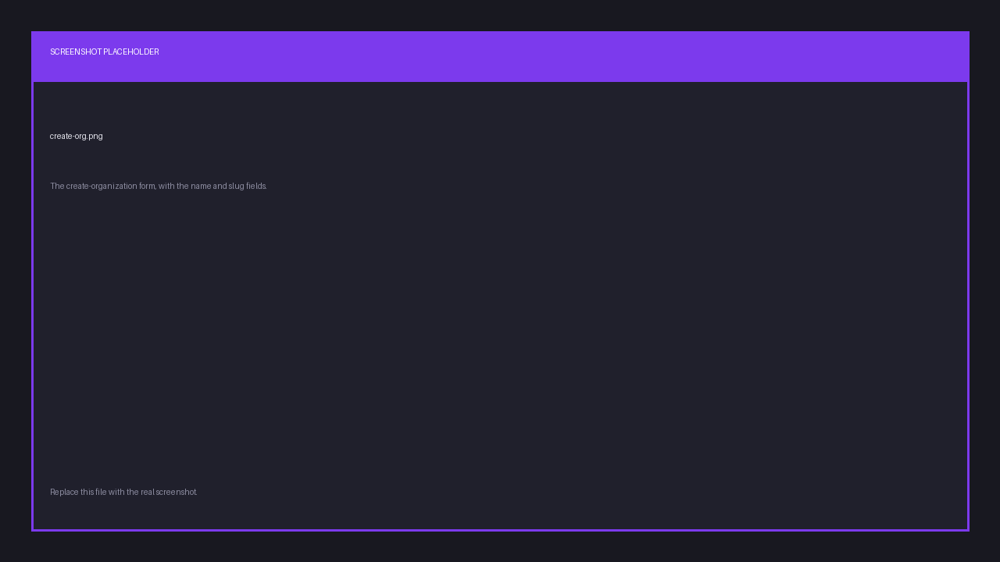
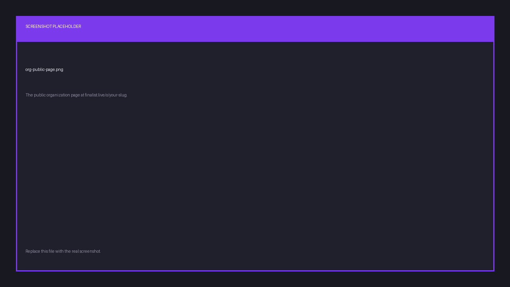
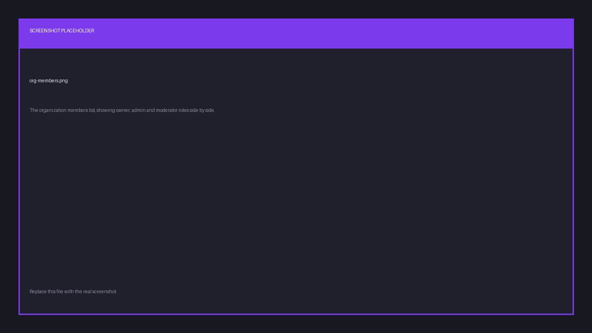
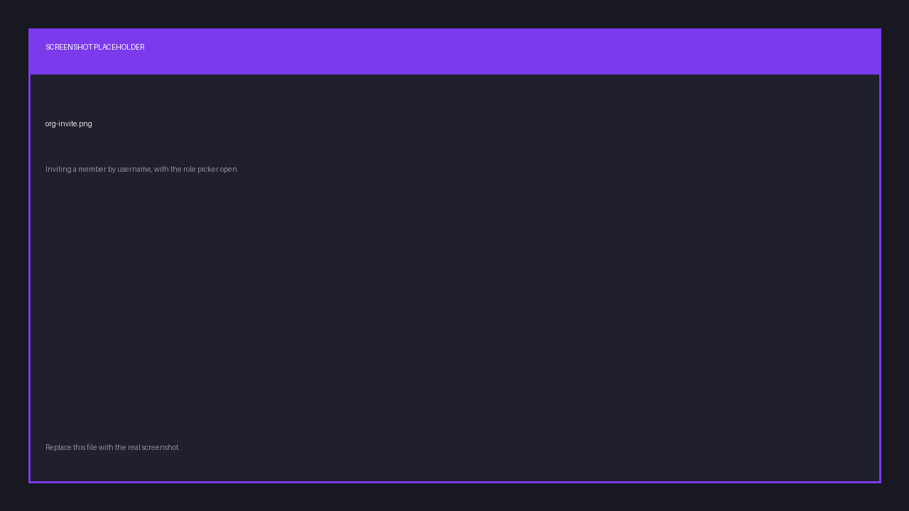
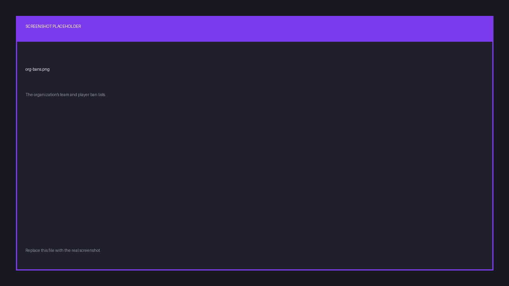

import { links } from '@site/constants';

# Organizations

Scrims belong to an **organization**, never to a person. Before you can host anything you
need one, and if you're on a team with other admins, the org is what you share.

## Create one

On <a href={links.manage}>app.finalist.live</a>, create an organization with a name and a
**slug**. The slug is lowercase and unique, and it becomes your public address:

```
https://finalist.live/o/your-slug
```



That public page shows your identity, the scrims you're hosting, and your player and team
leaderboards. Anyone can view it without an account.



You are the **owner** of any org you create.

## Switching organizations

You can belong to several organizations. The management app always acts on **one active
organization** at a time, picked from the switcher. Everything you do in `/manage` applies
to whichever org is active, so glance at the switcher before you create a scrim.

## Members and roles

Members join by **invitation only**. There's no request-to-join flow, and no public sign-up.

| Role | Can do |
|------|--------|
| **Owner** | Everything. Cannot be removed, and cannot have their role changed. |
| **Admin** | Every org action except transferring ownership. |
| **Moderator** | A limited set of moderation actions. |

There is exactly one owner: whoever created the org.



### Inviting

Invite by username, and search picks the account. Choose the role when you send it. Invites
**expire after 7 days**, and you can cancel a pending one at any time.



The invited person sees it in their invites and accepts or declines. You're notified either way.

## Branding

Give the organization a name, logo, banner and timezone. The timezone matters more than the
rest: it's what recurring scrim schedules are computed against.

## Bans

Organizations keep their own ban lists, separate from Discord's.

- **Team bans** stop a banned team registering for any of your scrims.
- **Player bans** stop a banned player registering, and a team carrying one is rejected.



Bans are per-organization. Banning someone from your org does not affect any other org.

## Audit log

Every consequential action is recorded: org created or updated, member roles changed, members
removed, invites sent, accepted, declined or cancelled, and every ban and unban. Each entry
records who did it and when.

There's also an access log showing member activity in the org.

## Connecting Discord

An org can connect Discord servers to receive announcements. See
[Connect your server](../discord/connect-server).
