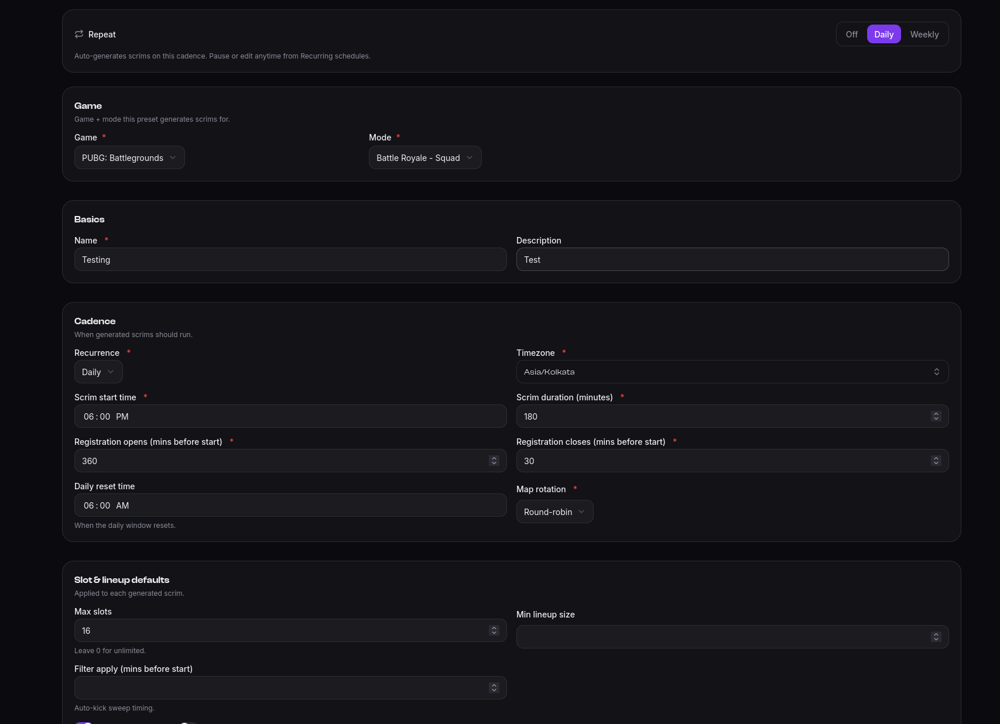
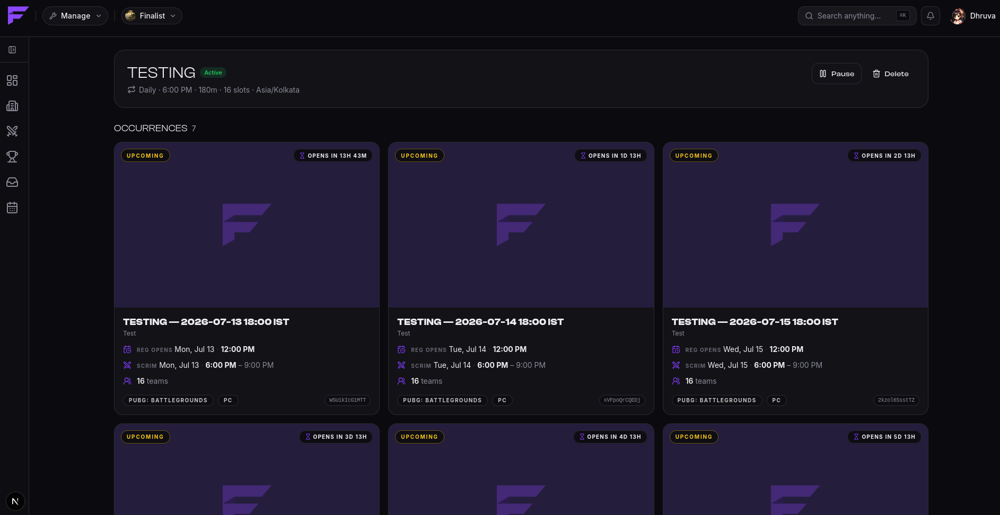

# Recurring scrims (presets)

If you run the same scrim every evening, don't create it every evening. A **preset** is a
recurring schedule: describe the scrim once, and Finalist creates each instance for you,
ahead of time.

They live with your scrims, under **Series**. You can also start one straight from the scrim
form: flip **Repeat** to Daily or Weekly and you're building a schedule rather than a one-off.
From Discord, `/host presets` opens them.

## What a preset holds

Everything a generated scrim needs, in four parts.

**Game.** The game and mode every instance is created for.

**Basics.** A name and description. Instances are named after the preset and their date, like
*Testing — 2026-07-13 18:00 IST*.

**Cadence.** When the scrims run:

| Setting | Meaning |
|---------|---------|
| Recurrence | **Daily**, or **weekly** on the days you pick |
| Timezone | The preset's own timezone. Every start time is read in it, so daylight-saving shifts don't drag your scrim an hour |
| Scrim start time | Time of day, e.g. 6:00 PM |
| Scrim duration | In minutes. Sets each instance's end time |
| Registration opens / closes | **Minutes before start**, not clock times — 360 and 30 means registration runs from six hours before until half an hour before |
| Map rotation | Manual, random or round-robin |

Registration windows being relative is the point: you set them once, and they follow every
instance to wherever its start time lands.

**Slot and lineup defaults**, applied to each generated scrim: max slots (0 for unlimited),
minimum lineup size, and the filter's auto-kick timing. These are the same settings a one-off
scrim has, so anything you can do to a single scrim, a preset can do to all of them.

## Generated scrims

Finalist looks **seven days ahead** and materializes upcoming instances as ordinary public
scrims. From then on they behave exactly like a scrim you created by hand: you can edit any
single instance, or cancel it, without touching the schedule.

The schedule's page lists everything it has produced, under **Occurrences**.

Instances are created once. Re-running the scheduler never duplicates them.

## Pausing and deleting

A preset is **active**, **paused**, or **cancelled**. **Only active presets generate scrims.**

**Pause** stops the next instances appearing without losing the configuration, which is the
right move for a seasonal break. **Resume** starts it again. Either way, scrims that were
already generated stay exactly where they are — pausing does not delete them.

**Delete** removes the schedule and keeps its existing scrims too. Teams registered for a
generated scrim never lose it because you tidied up a schedule.
