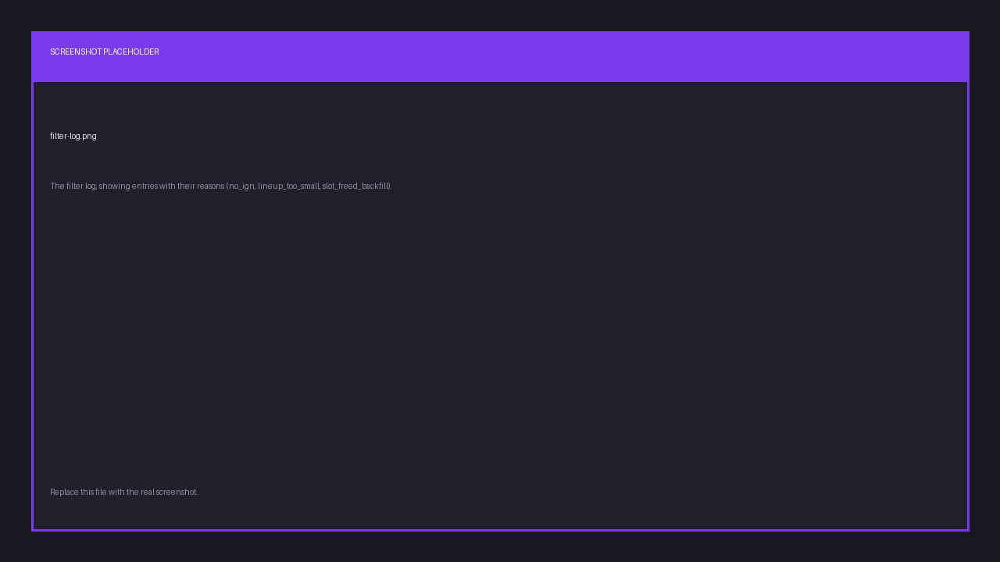

# Registrations, slots and the waitlist

## Slots

A slot is a team's position in the scrim: the row it occupies on the slot list and the
scoreboard. There are as many slots as **max slots**.

**Automatic slotlist** hands out slots in registration order: first team in takes slot 1.
Turn it off and you assign them yourself.

Either way you can, at any point before the scrim starts:

- assign a team to a slot
- swap two slots
- clear a slot, leaving it empty
- reset every slot at once
- delete a slot

Set **live slots visible** if you want players watching the grid fill up. Leave it off and
the list stays hidden until registration closes, which helps when slot order carries an
advantage you don't want telegraphed.

## The waitlist

Once every slot is taken, further registrations queue up on a waitlist, in order.

Finalist backfills automatically. Whenever a slot frees up, whether by a withdrawal or a team
removed by the pre-match filter, the first waitlisted team is promoted into it and its captain
is told. You can also promote a specific team out of order, or demote a registered team back to
the waitlist.

## Pre-match filters

Filters solve a specific problem: teams that register early and show up short-handed or
without IGNs.

Set **apply filters N minutes before start** and, at that moment, Finalist makes one pass:

1. If **require IGN** is on, players with no IGN for that game are removed from their lineup.
2. If a lineup is now below the **minimum lineup size**, that team is unregistered and its
   captain is notified.
3. Slots freed this way are backfilled from the waitlist, in order.

The pass runs **once per scrim**. Leave the minutes field empty and no filtering happens.

### The filter log

Every action the filter takes is recorded with its reason, so when a captain asks why they
were removed, you can answer.

Reasons are:

| Reason | Meaning |
|--------|---------|
| `no_ign` | Player had no in-game name set. |
| `lineup_too_small` | Team fell below the minimum lineup size. |
| `slot_freed_backfill` | Team was promoted into a freed slot. |
| `captain_action` | The captain withdrew or changed the lineup. |

The log also records manual promotions and demotions, so the slot list's history is complete.

## Lineups

Captains own their lineup: who plays, in what role, and under which IGN. Substitutes may be
included only up to the scrim's **max substitutes per team**, which can be zero.
