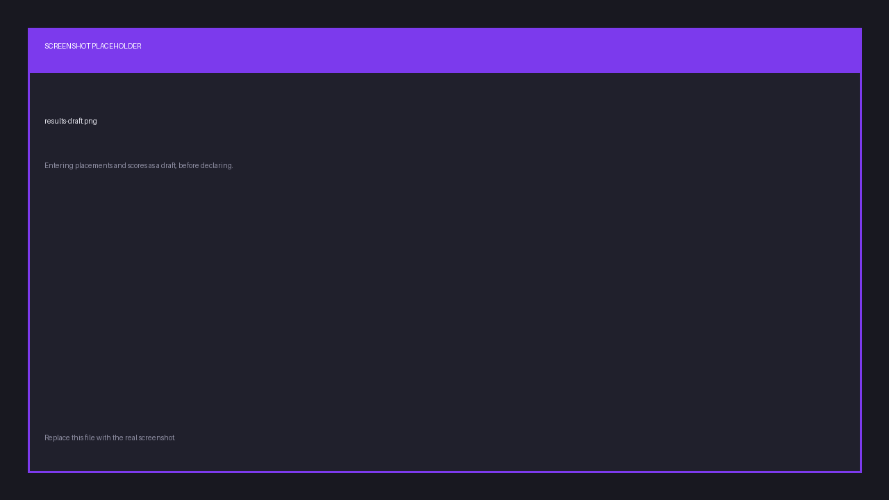

# Results

## Draft, then declare

Entering results and publishing them are two separate steps, on purpose.

1. **Save a draft.** Enter each team's placement and score. Save as often as you like. Players
   see nothing, so a half-finished scoreboard never leaks.
2. **Declare.** The results become public, and every participant is notified.

Placements start at 1, and ties are allowed.

## After declaring

Declared results appear on the scrim page, in `/scrim results` in Discord, in each player's
profile history, and in the organization's leaderboards.

You have a **24-hour window** after declaring to correct a mistake. Once it passes, the
results are locked.

So declare when you're confident, but a typo caught the next morning is still fixable.

## Leaderboards

Each organization has its own player and team leaderboards, built from declared results.
They're visible on your public page at `finalist.live/o/your-slug`, and in Discord through
`/org leaderboard`.

