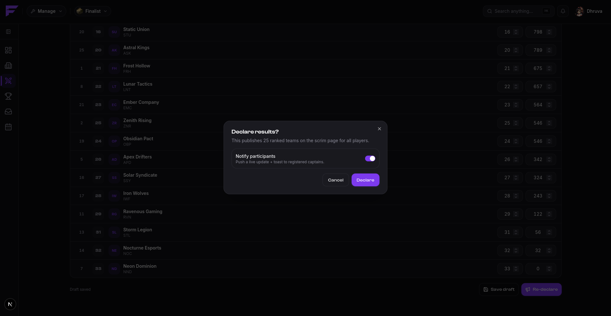
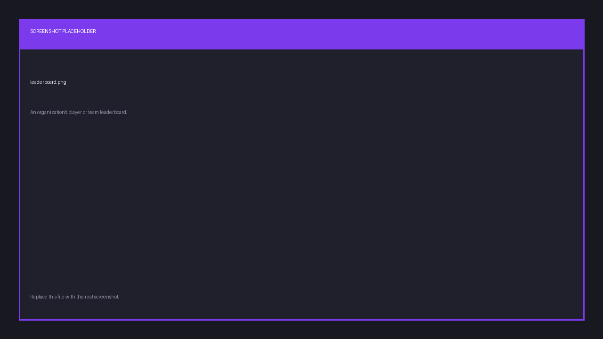

# Results

## Who can be ranked

Only the teams that **took a slot**. The slot list is the set of teams that were in the
lobby, so it's the only thing there is to rank. A team that sat on the waitlist never played,
and giving it a standing would be a lie.

That means results start with the slot list. If nothing is slotted, there's nothing to enter,
and the tab says so.

## Draft, then declare

Entering results and publishing them are two separate steps, on purpose.

1. **Save a draft.** Enter each team's score and placement. Save as often as you like. Players
   see nothing, so a half-finished scoreboard never leaks.
2. **Declare.** The results become public, and every participant is notified.

### Entering them

Each row is one slotted team: its slot, its name and IGN, a **place** and a **score**. A
counter tracks how far along you are, `12/25 ranked`.

Big scrim? **Search** by team, IGN or slot number, and **sort** by slot, score or placement.
Both are just views: they never change what gets saved.

### Auto-rank by score

Rather than typing 25 placements by hand, enter the scores and press **Auto-rank by score**.
Finalist orders the scored teams from highest to lowest and numbers them from 1.

Two rules are worth knowing, because they're what make the standings honest:

- **Ties share a place.** Two teams on the same score both get 2nd, and the next team down is
  4th. Nothing invents a winner the scores didn't name.
- **A team with no score stays unranked.** It isn't swept to the bottom of the table with a
  number attached; it simply has no placement until you give it one.

You can always overwrite any placement by hand afterwards.

### Declaring

**Declare results** asks you to confirm, and tells you how many ranked teams are about to go
public. **Notify participants** is on by default, pushing a live update to registered
captains; turn it off for a silent correction nobody needs to hear about.

You can't declare with nothing ranked. Once you have, the button becomes **Re-declare**.

## After declaring

Declared results appear on the scrim page, in `/scrim results` in Discord, in each player's
profile history, and in the organization's leaderboards.

You have a **24-hour window** after declaring to fix a mistake and re-declare. Once it passes
the results lock, the grid goes read-only, and the tab tells you why.

So declare when you're confident, but a typo caught the next morning is still fixable.

## Leaderboards

Each organization has its own leaderboards, built from declared results and nothing else. A
scrim you never declared contributes nothing.

There are two boards, **Players** and **Teams**, each ranked by points, with matches played,
wins and average placement alongside. Anyone looking at a board sees their own standing
called out above it.

They're visible on your public page at `finalist.live/o/your-slug`, and in Discord through
`/org leaderboard`.
