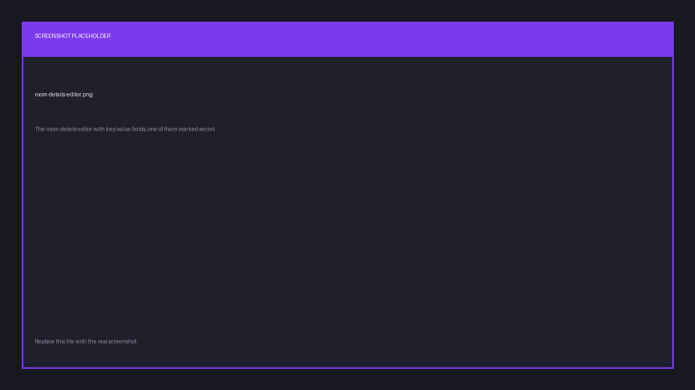
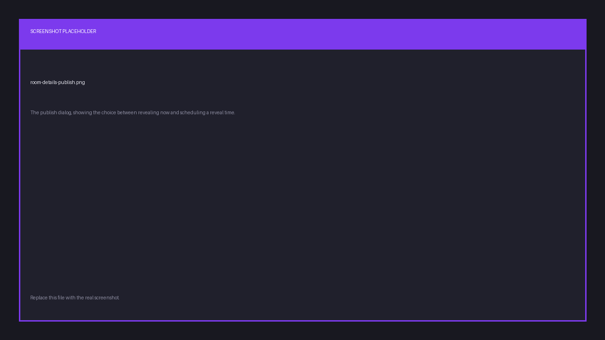

# Room details

Room details are the lobby credentials you hand to the teams that are actually playing:
room ID, password, and anything else you add. They are stored as simple key/value pairs, and
any pair can be marked **secret**.

The whole point is controlled release. Finalist shows them **only to the captain of a team
holding a slot**, and only once you publish.

## Write them

On the scrim's management page, add the fields you need. Saving is not publishing, so you can
prepare the lobby well in advance and nobody sees anything.

## Publish them

Publishing has two modes:

- **Now**, so captains can read them immediately.
- **At a scheduled time**, where Finalist reveals them at that moment, typically a few minutes
  before start, so the lobby isn't sitting open waiting to be crashed.

On reveal, slotted captains are notified in-app, by push, and by Discord DM.

## In Discord

If the organization has a [bound channel](../discord/connect-server), Finalist posts an
announcement there with a **Reveal room details** button:

> 🎟️ Room details are live — *your scrim*

Anyone can click it. Only slotted captains get anything back. Everyone else is told:

> 🔒 Only captains of a team in the slotlist can view the room details.

Clicking before reveal time says to check back closer to start. Clicking with an unlinked
Discord account prompts `/link` first.

Authorization is checked server-side on every click, so the button is safe to leave in a
public channel. The credentials themselves are only ever shown privately to the person who
clicked.
