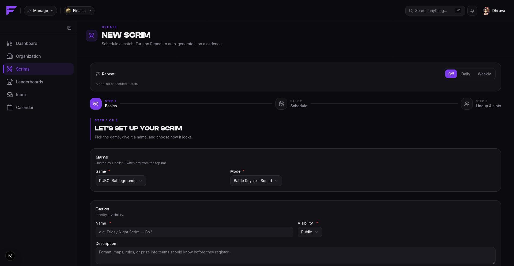
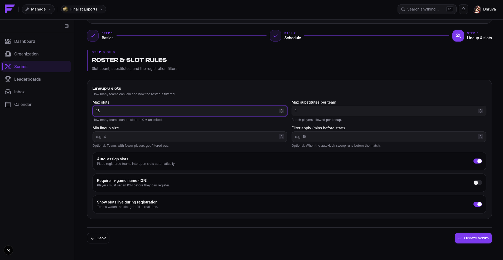
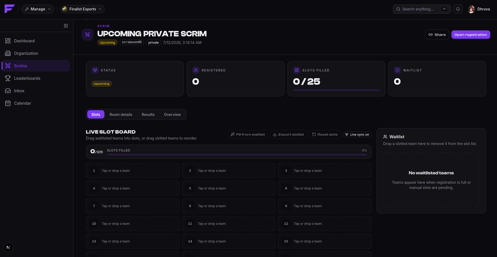

import { links } from '@site/constants';

# Creating and running a scrim

Scrims are created on <a href={links.manage}>app.finalist.live</a>, under the active
organization. From Discord, `/host create` takes you straight there.

## Create it

Creation is three steps: **Basics**, **Schedule**, then **Lineup & slots**.

Start with the game and the mode. The **mode decides the team size**, which in turn decides
how large a lineup teams may bring. You don't set a roster limit anywhere.

The **Repeat** switch at the top is worth knowing about before you fill anything in. Left
**Off**, you get a one-off scrim. Set to **Daily** or **Weekly**, the same form instead
creates a schedule that generates scrims on a cadence. See [Presets](./presets).

Across the three steps you set:

| Setting | What it controls |
|---------|------------------|
| Name, thumbnail | How the scrim presents itself. |
| Timezone | What all the times below are read in. |
| Start / end time | When play begins and ends. |
| Registration open / close time | The window teams can enter in. |
| Max slots | How many teams get in. The rest go to the waitlist. Zero means unlimited. |
| Max substitutes per team | May be zero. |
| Visibility | **Public** (listed) or **private** (invite link only). |
| Automatic slotlist | Assign slots in registration order, or by hand. |
| Live slots visible | Show the slot grid as it fills, or hide it until registration closes. |
| Minimum lineup size | Teams smaller than this get kicked by the filter. |
| Require IGN | Players without an IGN are dropped from the lineup. |
| Apply filters N minutes before start | Turns the two rules above on. Leave empty to disable. |

Every scrim gets a 12-character **share id** for its public URL, and private scrims also get
an **invite code**.

## Publish it

A new scrim starts as a **draft**, invisible to players. Publishing promotes it to
**upcoming**, and it becomes visible.

## Run it

You can drive each transition by hand, or let the clock do it. If you set the times,
Finalist opens registration, closes it, starts and completes the scrim on schedule, without
you touching anything.

| Action | Moves the scrim to |
|--------|--------------------|
| Publish | `upcoming` |
| Open registration | `registration_open` |
| Close registration | `registration_closed` |
| Start | `ongoing` |
| End | `completed` |
| Cancel | `cancelled` |

You may start a scrim directly from `registration_open` without closing registration first.

**A live scrim cannot be cancelled.** Cancel it before it starts, or run it to completion.
`completed` and `cancelled` are both final. See [the scrim lifecycle](../reference/scrim-lifecycle).

Each state change announces itself: to the scrim page in real time, and to any
[bound Discord channel](../discord/connect-server).

## The match

Within a scrim you create a **match**, the actual game instance, which carries the map and
its own start and end. Matches are created once registration is closed.

## Delete vs. cancel

Cancelling keeps the scrim and its history, and tells everyone. Deleting removes it. Cancel
unless you created it by mistake.
