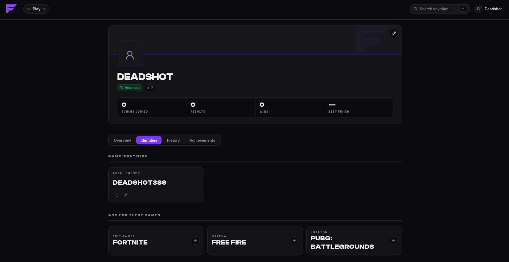
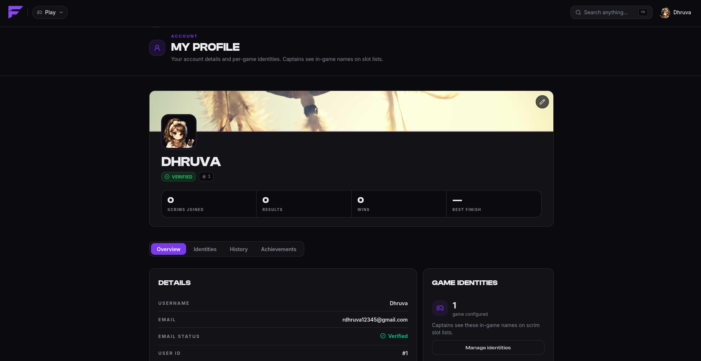
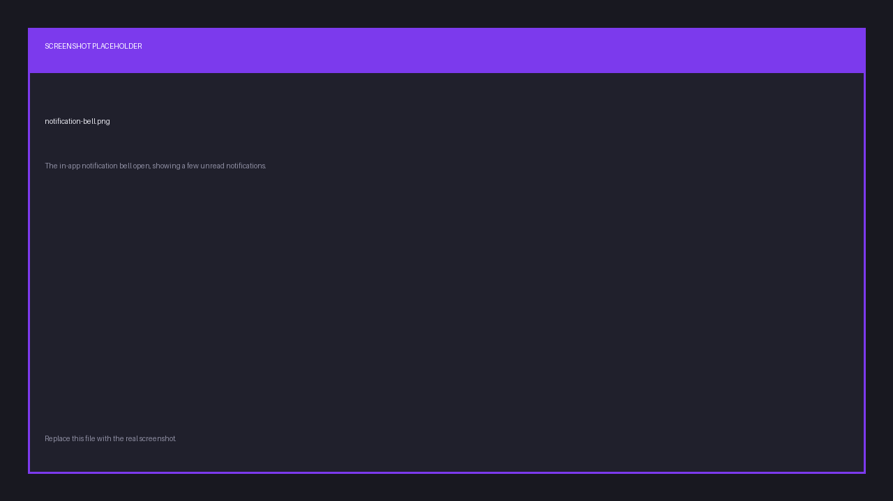

import { links } from '@site/constants';

# Your account

## Signing in

Sign in at <a href={links.play}>play.finalist.live</a> with **Discord**, **Google**, or your
**email address**. Email sign-in is passwordless: we send a 6-digit code, you enter it, you're in.
There is no password to forget.

Signing in with Discord also links your Discord account, which means the bot recognises you
without any extra step. If you sign in another way, you can still
[link Discord later](../discord/link-account).

## Your username

Before you can create a team, join a scrim, or do much of anything, you have to pick a
username. New accounts land on that step automatically. Usernames are unique, and the
signup form tells you as you type whether one is taken.

Your username is how hosts and other players find you. When someone invites you to an
organization, they search for it.

## In-game names (IGN)

An IGN is your name inside a particular game, and Finalist keeps one per game on your
profile. Set them once under **Profile → Game identities**.

This matters more than it looks:

- When your captain builds a lineup, your IGN fills in automatically.
- Hosts can set **Require IGN** on a scrim. When they do, Finalist removes players with
  a missing IGN from the lineup before the match. If that drops the team below the
  minimum lineup size, the **whole team is unregistered**.

So set your IGN for the games you play. A captain can override it for a single scrim if you
use a different name there, but the fallback is your profile.

Each game accepts only names in its own format, so an IGN that works for one game may be
rejected for another.

## Profile and appearance

Your profile carries your username, avatar and banner. Upload your own images, or pick from
the built-in gallery. Your profile also shows your recent scrim history and your standing.

## Notifications

Finalist reaches you in up to three places, and you can have all of them at once:

| Channel | What arrives |
|---------|--------------|
| In-app | Everything, in the bell menu. |
| Discord DM | Every in-app notification, if your Discord is linked. |
| Push | On devices where you allowed notifications. |

You'll be told when you're invited to a team or organization, when your team is registered
or removed from a scrim, when you're [promoted off a waitlist](./registering#the-waitlist),
when a scrim is starting, when room details are published, and when results are declared.

Delivery outside the app is best-effort. If Discord is down or your DMs are closed, the
notification still waits for you in the app.
