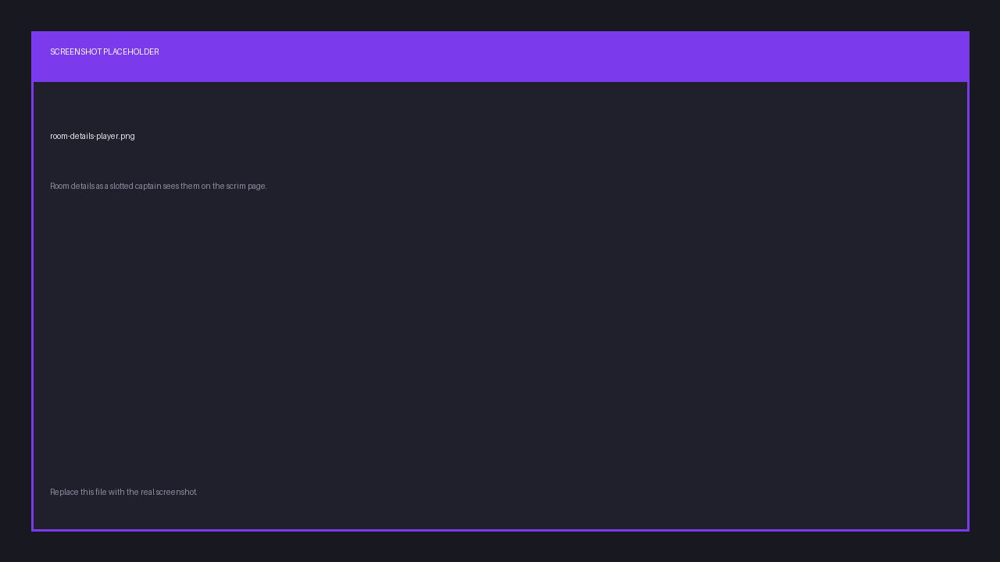
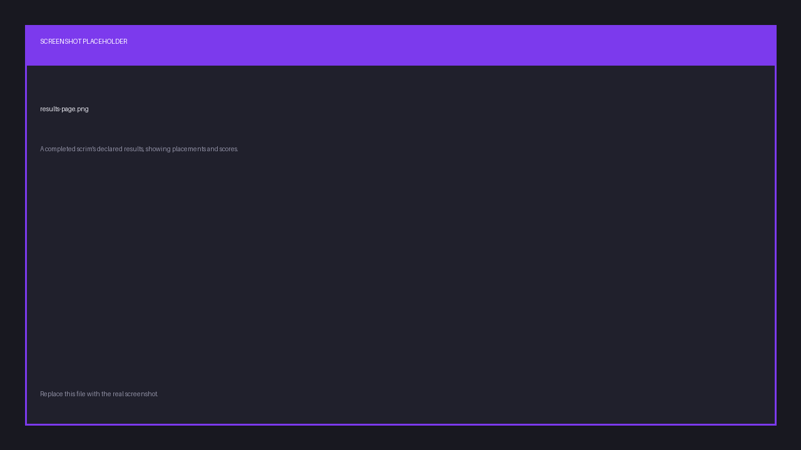

# During a scrim

## Room details

Room details are the lobby credentials: room ID, password, whatever the host adds. They are
deliberately restricted: **only the captain of a team that holds a slot can see them**, and
only after the host publishes them.

Hosts either publish immediately or schedule the reveal for a set time, usually a few minutes
before start, so the lobby isn't sitting open.

When they go live you get a notification, and you can read them:

- **On the web**, on the scrim's page.
- **In Discord**, where the bot posts an announcement in the server's bound channel with a
  **Reveal room details** button. Clicking it shows them to you privately, and only if you
  qualify. Everyone else who clicks is told they aren't a slotted captain.

Room details are shown as copyable fields, which matters on mobile.

If you click Reveal and the host hasn't revealed yet, you'll be told to check back closer
to the start time.

## The scrim starting

When the start time arrives, the scrim goes **live** and slotted captains get a notification:

> Your scrim is starting 🎮

The host runs the match itself in-game. Finalist tracks the map and the start/end of play.

## Results

After the scrim completes, the host enters placements and scores, then **declares** the
results. Nothing is visible to you until that moment, so a host working on a draft isn't
leaking half-finished standings.

When results are declared, you're notified, and they appear on:

- the scrim page on the web,
- `/scrim results` in Discord,
- your profile history, and the leaderboards.

Hosts have a **24-hour window** after declaring in which they can still correct results.
After that they're locked.

## Cancelled scrims

A host can cancel a scrim any time before it goes live, and everyone registered is notified.
Once a scrim is live it can no longer be cancelled. It runs to completion.
