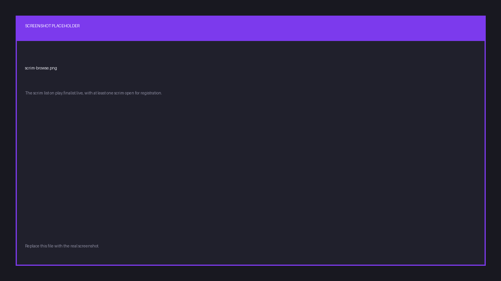
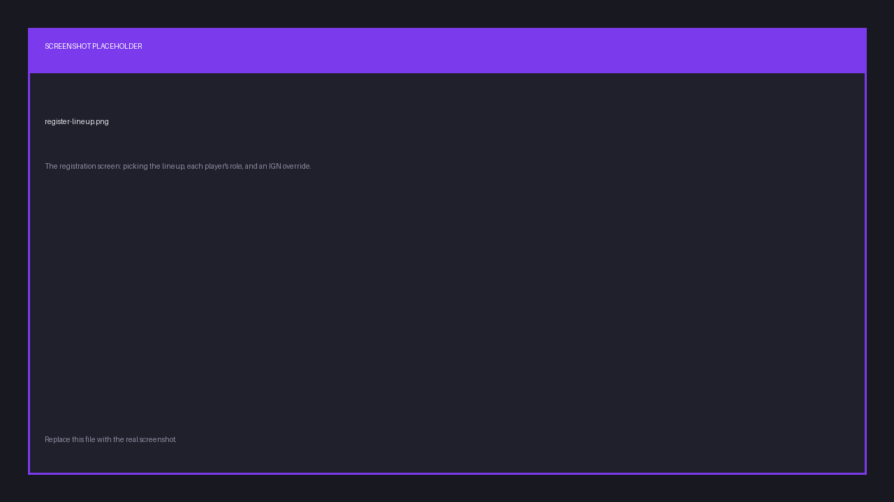
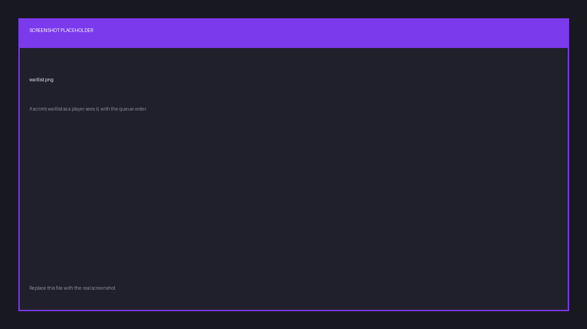
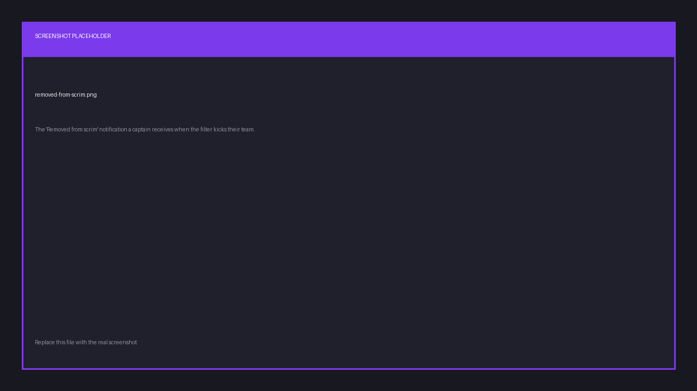

import { links } from '@site/constants';

# Registering for a scrim

**Only the captain registers.** Everyone else just needs to be on the roster with an IGN set.

## Find a scrim

Browse scrims on <a href={links.play}>play.finalist.live</a>. A scrim is open to registration
only while its status is **Registration open**. See [the scrim lifecycle](../reference/scrim-lifecycle).

Not every scrim is listed. **Private** scrims are reachable only through an invite link the
host shares. Every scrim, public or private, also has a 12-character **share id** in its URL,
which is what you pass to the bot's `/scrim` commands.

## Pick your lineup

Registering means choosing which of your roster is actually playing. For each player you
pick a role:

| Role | Notes |
|------|-------|
| Captain | You. |
| Member | A normal player. |
| Substitute | Only allowed if the scrim permits substitutes. |

The lineup must fit the game mode's team size. This is where a size limit finally applies,
not on the team itself. Each player's IGN is filled in from their profile, and you can
override it for this scrim alone if someone plays under a different name here.

Finalist rejects the registration if a player appears twice, if someone isn't on the team,
if the lineup is empty, or if the scrim requires IGNs and one is missing or malformed.

## Once registered

Your team appears in the scrim's registered teams. If the host uses automatic slotting, a
slot number is assigned; otherwise the host assigns them by hand. Some hosts hide the slot
list until registration closes.

The captain can withdraw the team at any point before the scrim starts.

## The waitlist

When a scrim is full, further registrations join a **waitlist** in order. If a slot frees up,
because somebody withdrew or a team was auto-kicked, the first waitlisted team is promoted
into it automatically, and its captain is notified:

> You got a slot! 🎉

Hosts can also promote and demote teams by hand.

## Pre-match filters

Hosts may configure Finalist to check every lineup a set number of minutes before start.
This is worth understanding, because it can remove you from a scrim you thought you had.

At that moment, and only once:

1. If the scrim **requires IGNs**, players with none are dropped from the lineup.
2. If the lineup is now smaller than the scrim's **minimum lineup size**, the whole team is
   unregistered. The captain is notified: *Removed from scrim*.
3. Any slot freed this way is backfilled from the waitlist.

The fix is boring and effective: make sure everyone in the lineup has their IGN set for that
game well before the scrim starts.
