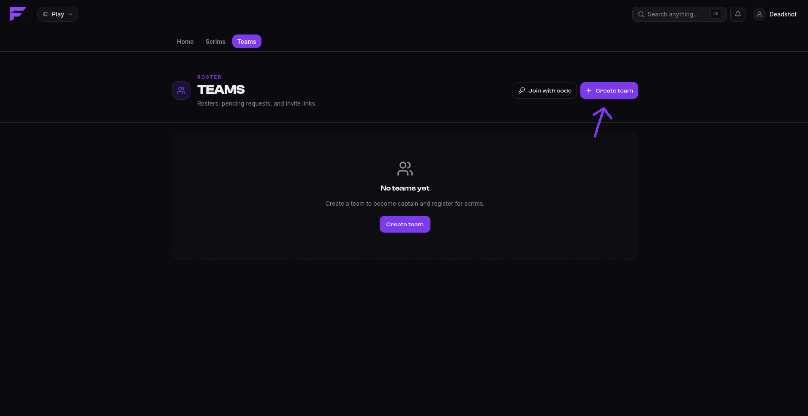
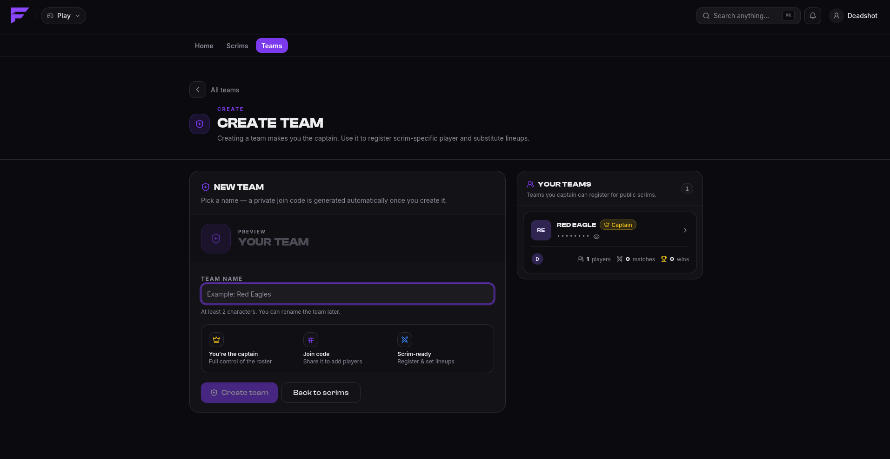
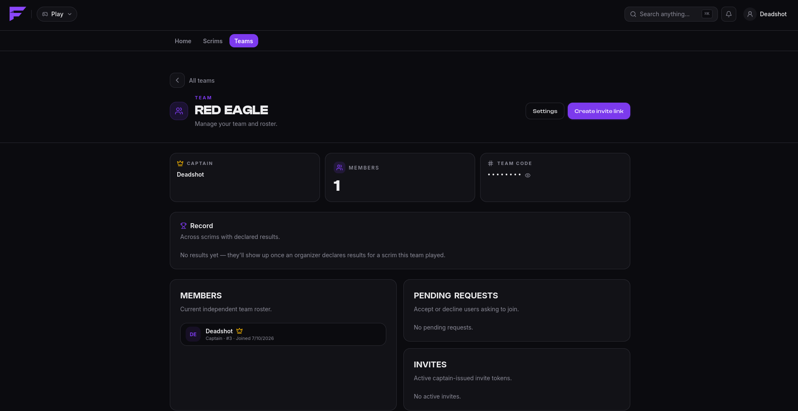
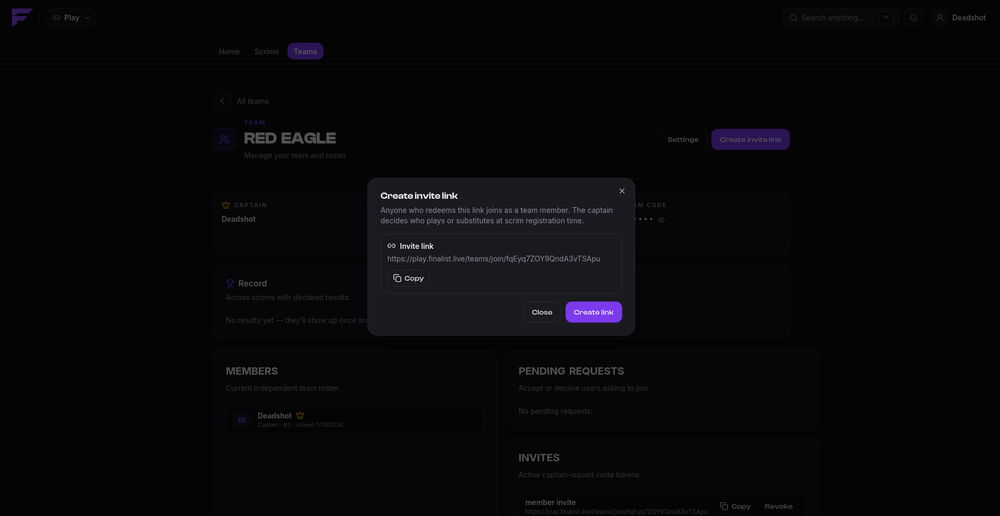
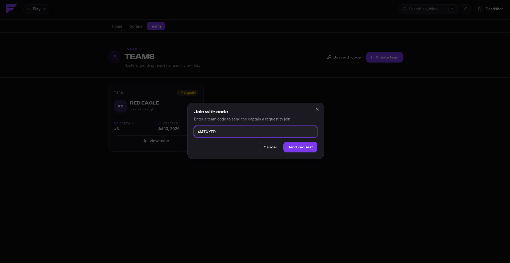
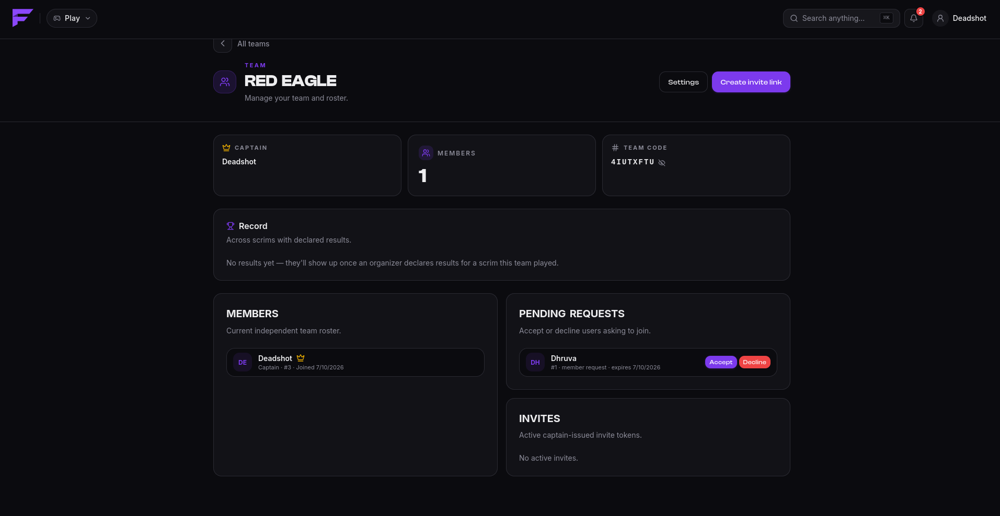

import { links } from '@site/constants';

# Teams

A team is a roster with one captain. **Teams have no size limit**, so you can keep twenty
players on the roster. What's limited is the *lineup* you bring to a given scrim, and that
limit comes from the game mode, not the team.

That is the one idea worth internalising: a team is who you play with, a lineup is who you
brought today.

## Create a team

On <a href={links.play}>play.finalist.live</a>, go to **Teams → New team**, give it a name,
and you're the captain. Finalist gives the team a **team code** at the same time, a short
code others use to ask to join.

Once it exists, the team's own page carries the roster, the captain, the team code, any
pending join requests, and the invite links you've issued.

## Joining a team

There are two ways in, and they differ in who does the approving.

### With an invite link

The captain generates a link. Opening it shows you the team before you commit; accepting
puts you straight on the roster with no approval step. Captains can cap how many times a
link is used and when it expires, and revoke it at any time.

A link can add you as a **member** or as a **substitute**. The captain chooses which when
creating it.

### With a team code

You search for the team, send a join request using its code, and the **captain approves or
declines** it. Pending requests expire after **one hour**, so if nobody answers, just ask again.

The captain sees it under **Pending requests** and accepts or declines.

You can see and cancel your own outgoing requests from the Teams page.

## Members and substitutes

| Type | Meaning |
|------|---------|
| Member | Counts toward the lineup normally. |
| Substitute | Can be put in the lineup only when the scrim allows substitutes. |

Hosts set how many substitutes a team may field per scrim; it can be zero.

## Captains

The captain is the only person who can:

- register the team for a scrim, and pick the lineup
- unregister it
- accept or decline join requests
- create and revoke invite links
- kick members
- rename or delete the team

Everyone else is on the roster and plays.

## Leaving

Any member can leave a team from its page. **The captain cannot leave their own team**, because a
team is never captainless. If you're the captain and you're done with the team, delete it.

Leaving a team does not withdraw you from a scrim that has already started.
