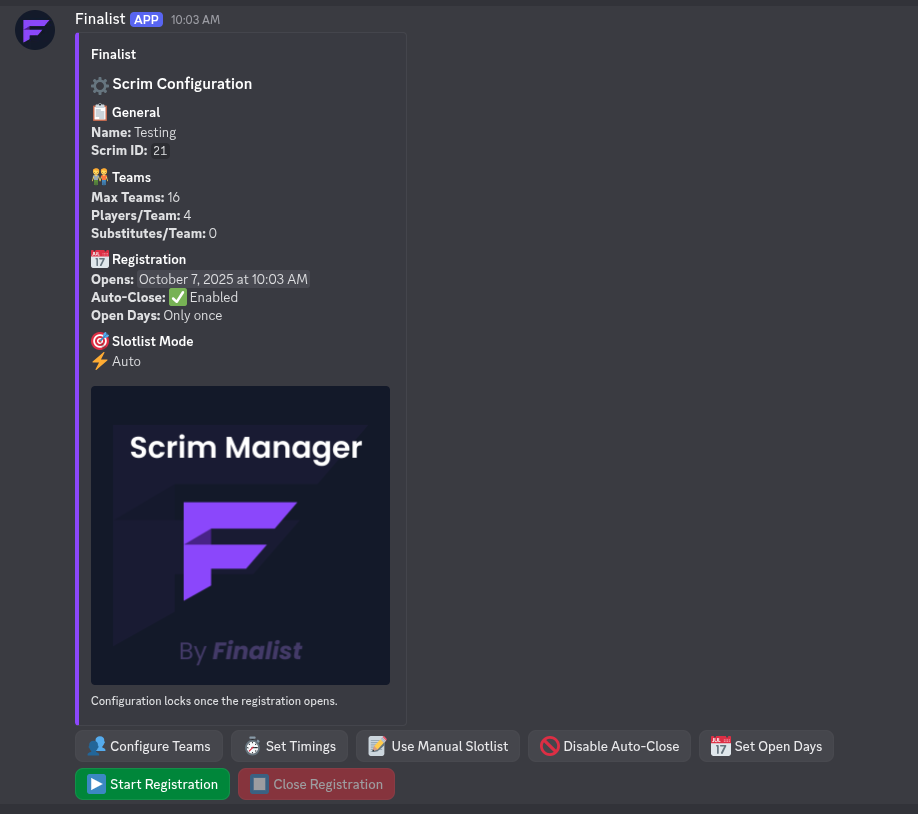
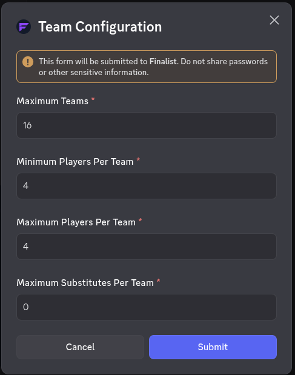
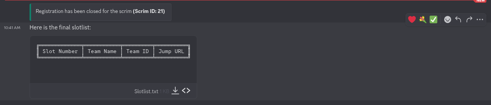
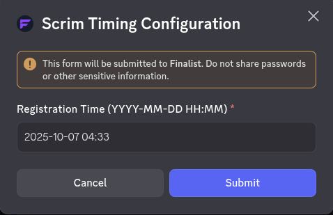
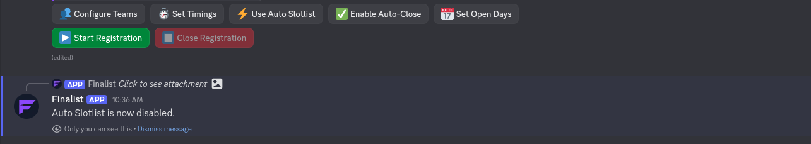
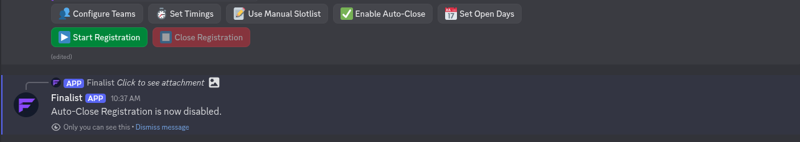
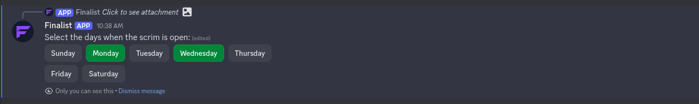

# Configure a scrim

After creating a scrim, you can configure your scrim settings in the admin channel. In the admin channel, you will find a message with buttons to manage your scrim. If you don't see the message, use the `/sconfig resend` command in the admin channel to generate it.

## Admin Channel Buttons

- **Configure Scrim**: Opens a modal to configure the scrim settings. You can set the max_player per team, min_player per team, max_teams, and max_substitute.  
  
- **Start Registration**: This will make the `#register` channel visible to everyone and allow users to register for the scrim.  
  
- **Close Registration**: This will hide the `#register` channel and prevent users from registering. In the below Image, I did not assign any slot to the team so it is empty.  
  
- **Set Timing** : Opens a modal to set the scrim timing. You can set the registration start time.  
  
- **Use Manual Slotlist**: This will allow you to manually manage the slots in the `#participants` channel. You can Switch back to **Automatic slotlist** management by clicking the button again.  
  
- **Disable AutoClose**: This will prevent the scrim from automatically closing when the max number of teams is reached. You can disable AutoClose again by clicking the button again.  
  
- **Set Open Days**: Open a Select Menu to choose the days of the week when registration is open.
  
