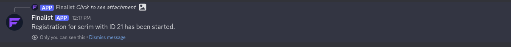
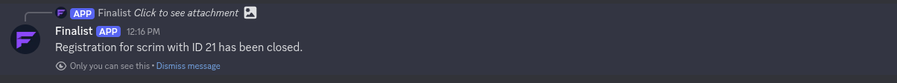
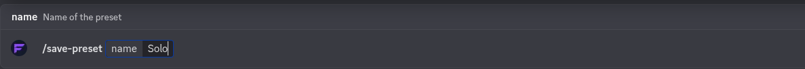

# Configure a scrim

After creating a scrim, you can configure your scrim settings in the admin channel. In the admin channel, you will find a message with buttons to manage your scrim. If you don't see the message, use the `/sconfig resend` command in the admin channel to generate it.


## Admin Channel Buttons
  | Button | Description |
  |--------|-------------|
  |Configure Scrim|Opens a modal to configure the scrim settings. You can set the `max_player_per_team`, `min_player_per_team`, `max_teams`, and `max_substitute`.|
  |Start Registration|This will make the `#register` channel visible to everyone and allow users to register for the scrim.|
  |Close Registration|This will hide the `#register` channel and prevent users from registering.|
  |Set Timing|Opens a modal to set the scrim timing. You can schedule the registration date and time.|
  |Use Manual Slotlist|This will allow you to manually manage the slots in the `#participants` channel. You can Switch back to **Automatic slotlist** management by clicking the button again.|
  |Disable AutoClose (By-default: Enabled)|This will prevent the scrim from automatically closing when the `max_number_of_teams` is reached. You can disable AutoClose again by clicking the button again.|
  |Set Open Days|Open a Select Menu to choose the days of the week when registration is open.|

## Examples

### Configure Scrim 
  
### Start Registration
  
  
### Close Registration
  
  
### Set Timing 
  
### Use Manual Slotlist
  
### Disable AutoClose
  
### Set Open Days
  

## Save Presets
You can save the current scrim configuration as a preset using the `/save-preset` command in the admin channel. This allows you to quickly apply the same settings to future scrims. For example, to save the current configuration as `Solo`, you would use the following command:
```
/save-preset name:Solo
```

