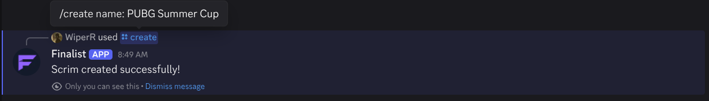
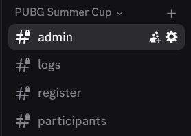

# Creating a Scrim

Creating a scrim with Finalist is simple. Use the `/create` command with the required `name` argument:

```
/create name:PUBG Summer Cup
```

You can also include optional arguments to customize the scrim:

- **`name`** (required): The scrim’s name. Displayed in the lobby and used to identify the scrim.
- **`preset`** (optional): Choose from your saved presets.
- **`template`** (optional): Select from built-in templates.

When the command runs, Finalist automatically creates a category with four channels:

| Channel | Visibility | Purpose |
|---------|------------|---------|
| **admin** | Admins only | Manage the scrim |
| **register** | Everyone | Register for the scrim (visible only when registration are open) |
| **logs** | Admins only | Logs all scrim actions |
| **participants** | Admins only | Lists all registered participants (manage teams, slots) |

---

## Examples

### Creating a Scrim


### Scrim Channels


### Admin Message


