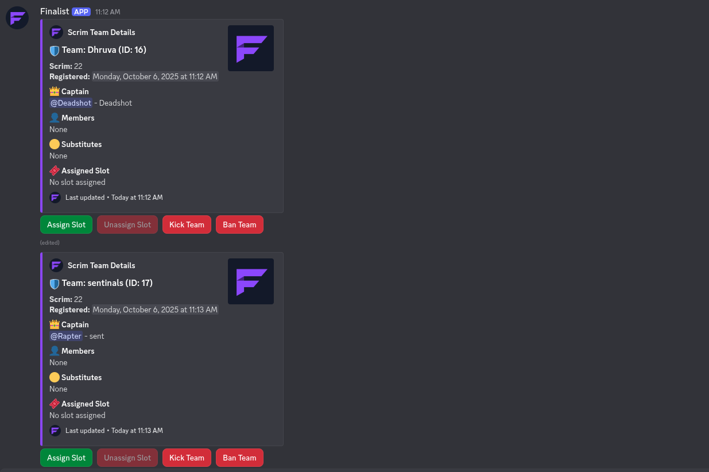
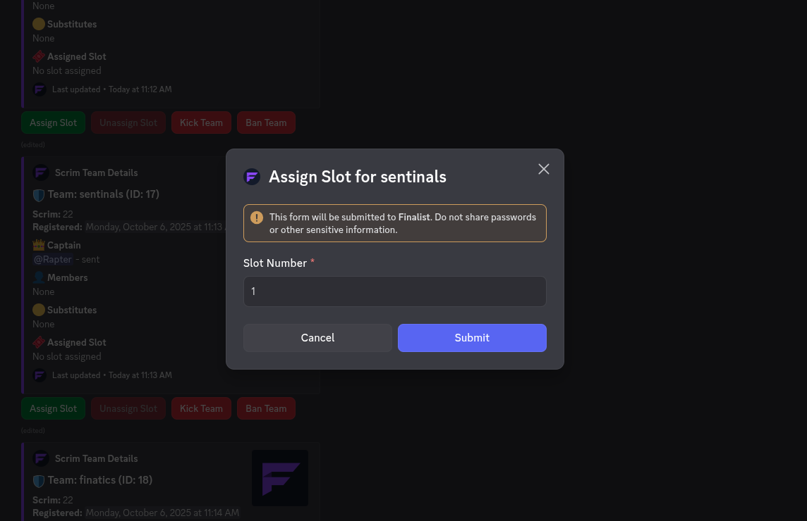
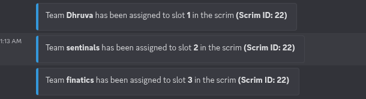
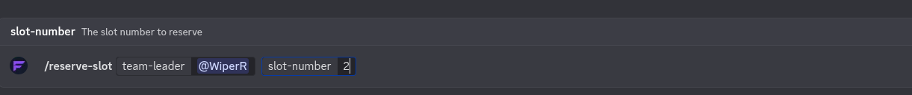
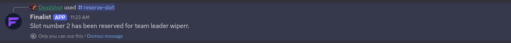
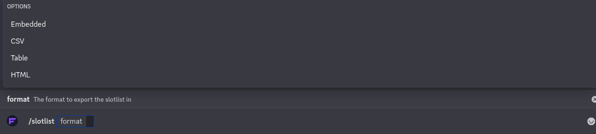

# Slot management and slotlist export

After Starting the registration, users can register for the scrim in the `#register` channel. Once users have registered their teams, they will be assigned slots in the `#participants` channel.  


## Manual Slotlist Management

If the scrim is set to **Manual Slotlist** management, you can manually assign slots to teams in the `#participants` channel. To assign a slot to a team, click on the `Assign Slot button` next to the team name. This will open a modal where you can select the slot number to assign to the team.


## Automatic Slotlist Management

If the scrim is set to **Automatic Slotlist** management (default), Finalist will automatically assign slots to teams based on the order of registration. The first team to register will be assigned to Slot 1, the second team to Slot 2, and so on upto `max_number_of_teams`.  


## Reserve slots for specific teams

If you want to reserve a specific slot for a team, you can use the `/reserve-slot` command in the `#admin` channel. For example, to assign(captain only) `WiperR` to Slot 2, you would use the following command:  
```
/reserve-slot team-leader:WiperR slot-number:2
``` 
  

This will reserve Slot 2 for `WiperR`, and the next team to register will be assigned to Slot 1, and so on. If `WiperR` registers later, they will be assigned to Slot 2.


## Export Slotlist

You can export the slotlist in four formats using the `/slotlist` command in the `#admin` channel. The available formats are: `Table`, `Embed`,`Csv`, `Html`.
```
/slotlist format:Table
/slotlist format:Embed
/slotlist format:Csv
/slotlist format:Html
```

