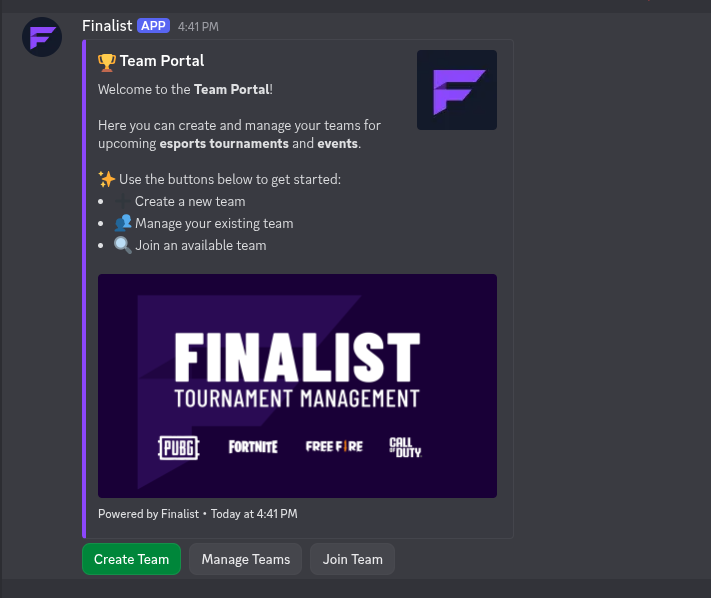
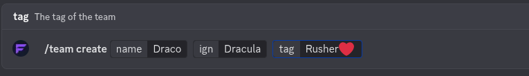

# Create Your Team

## Using Command

Creating a team with Finalist is straightforward. Use the `/team create` command with the required `name` argument:

```
/team create name:My Awesome Team
```
You can also include optional arguments to customize your team:
- **`name`** (required): The team’s name. Displayed in the team list and used to identify the team.
- **`tag`** (optional): A short tag or abbreviation for your team.
- **`ign`** (optional): Your in-game name.

When the command runs, Finalist automatically creates a team with the specified details.

## Using Team Portal
You can also create a team using the Team Portal. Find Team Portal in the Server if you cann't **Contact Server Scrim organizer** to run the `/teamportal` command on desired channel, So player can create team.
1. Click on **Create Team** button on Team Portal.
2. Fill in the required details such as team name, tag, and in-game name.
3. Submit the form to create your team.
4. Share the team code with your teammates so they can join your team.

You can also **Manage** your team from Team Portal.

## Examples

### Team Portal


### Create Team Command


